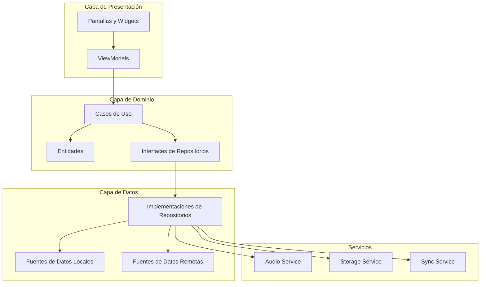

## Arquitectura de la Aplicación

### Patrón Arquitectónico
- [ ] Arquitectura MVVM con Clean Architecture
  - **Descripción**: Separación clara de responsabilidades siguiendo MVVM
  - **Requisitos**: Provider/Riverpod o similar para gestión de estado
  - **Implementación**: Estructura de ViewModels, Repositories y Services
  - **Pruebas**: Verificación de la separación de responsabilidades
  - [ ] Definición de modelos de dominio
  - [ ] Implementación de ViewModels reactivos
  - [ ] Repositorios para acceso a datos

### Estructura de Directorios
```
lib/
├── core/
│   ├── constants/
│   ├── theme/
│   └── utils/
├── data/
│   ├── local/
│   │   ├── datasources/
│   │   └── models/
│   ├── remote/
│   │   ├── api/
│   │   └── dto/
│   └── repositories/
├── domain/
│   ├── entities/
│   ├── repositories/
│   └── usecases/
├── presentation/
│   ├── common/
│   │   ├── widgets/
│   │   └── controllers/
│   ├── music/
│   │   ├── screens/
│   │   ├── widgets/
│   │   └── viewmodels/
│   ├── podcast/
│   │   ├── screens/
│   │   ├── widgets/
│   │   └── viewmodels/
│   └── player/
│       ├── screens/
│       ├── widgets/
│       └── viewmodels/
└── services/
    ├── audio/
    ├── storage/
    └── sync/
```

as
## Diagrama de Arquitectura

